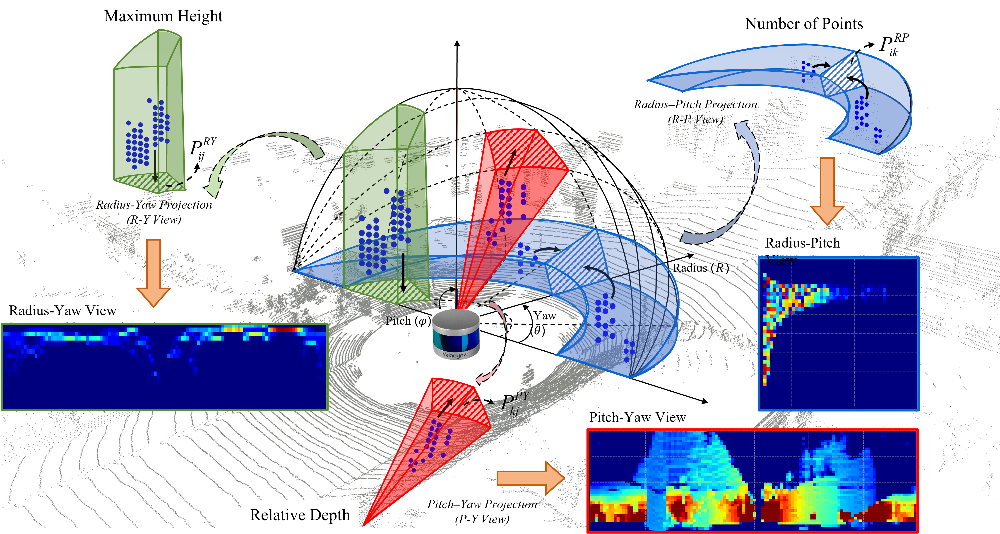
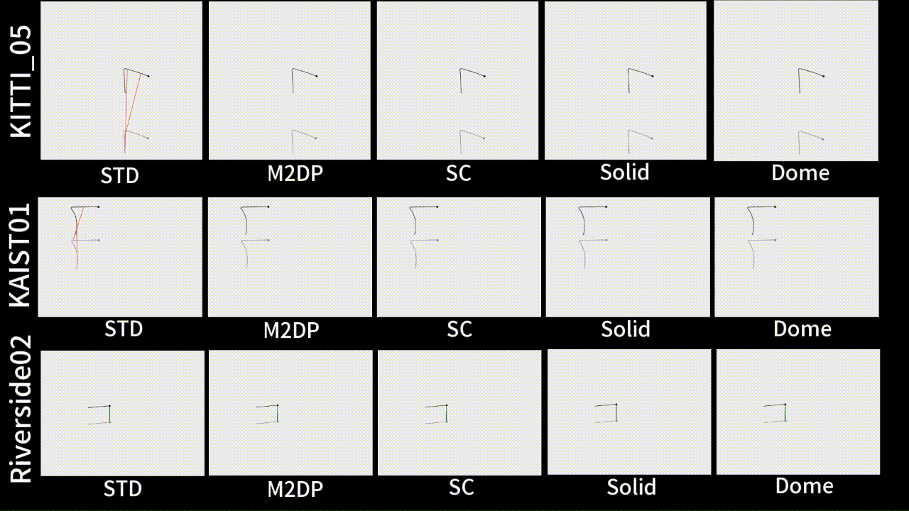

<p align="center">
  
</p>

<h1 align="center">
Dome: Fast and Robust LiDAR Place Recognition via Spherical Three-View Feature Fusion
</h1>

<p align="center">
CHONGQING UNIVERSITY · DEYANG INTELLIGENT ROBOT RESEARCH INSTITUTE
</p>


**Dome** is a fast and robust LiDAR place recognition method based on spherical multi-view projection and handcrafted descriptor fusion.  
The method has been **accepted and published in the journal _Measurement_**.

Dome achieves high recognition accuracy and strong robustness in complex environments while maintaining very high runtime efficiency.  
It is a **pure C++ / CPU-only** solution and does **not rely on deep learning or GPU acceleration**.
<p align="center">
  
</p>

---

## 🔍 Overview

Dome projects a LiDAR point cloud onto **three complementary spherical views**:

- **R–P view** (Radius–Pitch)  
- **P–Y view** (Pitch–Yaw)  
- **R–Y view** (Radius–Yaw)  

From these views, Dome encodes geometric cues including relative depth, point density, and elevation distribution.

View-specific enhancement strategies are applied:

- **Density-aware convolution** in the P–Y view  
- **Geometry-aware weighting** in the R–Y view  

For efficient loop detection, Dome performs **cosine similarity matching in the frequency domain**, accelerated by **FFTW**, enabling real-time performance on large-scale datasets.

---
## 🎬 Demo

<p align="center">
  
</p>

---
## 🚀 Features

- 🔁 Robust loop closure under viewpoint change, rotation, and partial occlusion  
- ⚡ Ultra-fast descriptor matching  
- 📦 Pure C++ implementation with FFTW acceleration  
- 🔎 No dependency on deep learning or GPU  
- 📊 Validated on **KITTI** and **MulRan** datasets  

---

## 📦 Environment & Dependencies

### Tested Environment

- Ubuntu 18.04  
- **ROS Melodic**  
- CMake ≥ 3.10  
- CPU-only  

### Core Dependencies

- **C++17**
- **PCL 1.8.1** (default in ROS Melodic)
- **OpenCV ≥ 3.2**
- **Eigen3 ≥ 3.3**
- **FFTW3**
- ROS packages:
  - `roscpp`
  - `pcl_ros`
  - `cv_bridge` (optional, for visualization)

---

## 🛠️ FFTW Installation

Dome relies on FFTW for fast frequency-domain similarity computation.

### Option 1: Install via APT (Recommended)

```bash
sudo apt update
sudo apt install -y libfftw3-dev
```

### Option 2: Build FFTW from Source
```bash
wget http://www.fftw.org/fftw-3.3.7.tar.gz
tar -xzf fftw-3.3.7.tar.gz
cd fftw-3.3.7
./configure --enable-shared
make -j$(nproc)
sudo make install
sudo ldconfig
```
---

## 🛠️ Build Instructions

```bash
mkdir -p ~/dome_ws/src
cd ~/dome_ws/src
git clone https://github.com/ljkljk123/Dome-master.git
cd ..
catkin_make
source devel/setup.bash
```
---

## 🧪 Run Example
```bash
roslaunch Dome_master run_dome.launch
```
---
## ⚠️ Notes

This repository does **not** provide LiDAR data files.  
Users are required to download the corresponding datasets (e.g., **KITTI**, MulRan) independently.

Please ensure that the **LiDAR `.bin` file paths** in the source code are correctly configured  
according to your local dataset location before running the program.
---

## 📄 Citation

If you find this work useful, please cite:

```bibtex
@article{Lu2026Dome,
  author  = {Jiakai Lu and Jun Liu and Lan Qin and Min Li},
  title   = {Dome: Fast and robust LiDAR place recognition via spherical three-view feature fusion},
  journal = {Measurement},
  volume  = {263},
  year    = {2026},
  pages   = {120174},
  issn    = {0263-2241},
  doi     = {10.1016/j.measurement.2025.120174}
}
```
---
## 📌 Commercial Use

If you intend to use **Dome** for **commercial purposes**,  
please contact **Prof. Min Li** for authorization:

📧 **Email:** limin780815@cqu.edu.cn
---
